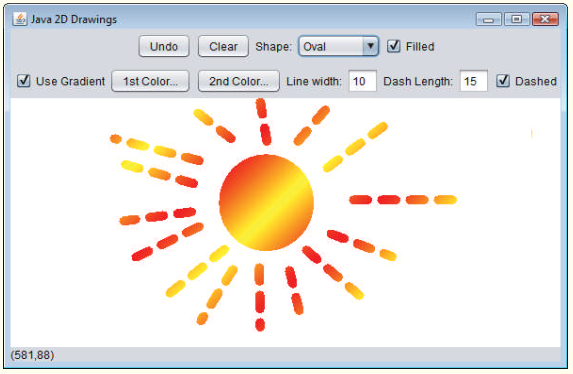

# 1331-estudo-de-caso-java2d
O Java 2D introduz várias novas capacidades para criar imagens gráficas únicas e impressionantes. Adicionaremos um pequeno subconjunto desses recursos ao aplicativo de desenho que você criou na Questão 12.17. Nesta versão, você permitirá que o usuário especifique
gradientes para o preenchimento de formas e para alterar as características do traço a fim de desenhar linhas e contornos das formas. O
usuário será capaz de escolher as cores que compõem o gradiente e configurar a largura e comprimento do traço da linha tracejada.
Primeiro, você deve atualizar a hierarquia MyShape para suportar a funcionalidade do Java 2D. Faça as seguintes alterações na classe

MyShape:

a) Altere o método abstract draw do tipo de parâmetro de Graphics para Graphics2D.

b) Altere todas as variáveis do tipo Color para o tipo Paint a fim de permitir suporte a gradientes. [Observação: lembre-se de que a
classe Color implementa a interface Paint.]

c) Adicione uma variável de instância do tipo Stroke à classe MyShape e um parâmetro Stroke ao construtor para inicializar a nova
variável de instância. O traço padrão deve ser uma instância da classe BasicStroke.

Cada uma das classes MyLine, MyBoundedShape, MyOval e MyRectangle deve adicionar um parâmetro Stroke aos seus construtores. Nos métodos draw, cada forma deve configurar Painte Strokeantes de desenhar ou preencher uma forma. Como Graphics2D
é uma subclasse de Graphics, você pode continuar a utilizar os métodos Graphics drawLine, drawOval, fillOval, e assim por
diante para desenhar as formas. Quando esses métodos são chamados, eles desenharão a forma apropriada utilizando as configurações
Paint e Stroke especificadas.
Em seguida, você atualizará a DrawPanel para tratar os recursos Java 2D. Altere todas as variáveis Color para variáveis Paint. Declare uma variável de instância currentStroke do tipo Stroke e forneça um método set para ela. Atualize as chamadas aos construtores
individuais da forma para incluir os argumentos Paint e Stroke. No método paintComponent, faça uma coerção da referência a
Graphics para o tipo Graphics2D e utilize a referência Graphics2D em cada chamada ao método MyShape draw.
Em seguida, torne os novos recursos Java 2D acessíveis na GUI. Crie um JPanel de componentes GUI para configurar as opções Java
2D. Adicione esses componentes à parte superior de DrawFrame abaixo do painel que contém atualmente os controles padrão da forma
(veja a Figura 13.34). Esses componentes GUI devem incluir:

a) Uma caixa de seleção para especificar pintura usando um gradiente.

b) Dois JButtons que mostram um diálogo JColorChooser para permitir que o usuário escolha a primeira e segunda cores no gradiente. (Estes substituirão o JComboBox utilizado para escolher a cor na Questão 12.17.)

c) Um campo de texto para inserir a largura de Stroke.

d) Um campo de texto para inserir o comprimento do traço da linha tracejada Stroke.

e) Uma caixa de seleção para escolher se desenha uma linha tracejada ou sólida.

Se o usuário optar por desenhar com um gradiente, configure Paint no DrawPanel para ser um gradiente das duas cores escolhidas
pelo usuário. A expressão

new GradientPaint(0, 0, color1, 50, 50, color2, true))

cria um GradientPaint que, a cada 50 pixels, vai diagonalmente da parte superior esquerda para a parte inferior direita. As variáveis
color1 e color2 representam as cores escolhidas pelo usuário. Se o usuário optar por não utilizar um gradiente, simplesmente configure
Paint em DrawPanel como a primeira Color escolhida pelo usuário.
Para traços, se o usuário escolher uma linha sólida, crie o Stroke com a expressão

new BasicStroke(width, BasicStroke.CAP_ROUND, BasicStroke.JOIN_ROUND)

onde a variável largura é a largura especificada pelo usuário no campo de texto de largura da linha. Se o usuário escolher uma linha tracejada, crie o Stroke com a expressão

new BasicStroke(width, BasicStroke.CAP_ROUND, BasicStroke.JOIN_ROUND, 10, dashes, 0)

onde largura é novamente a largura no campo de largura da linha e dashes é um array com um elemento cujo valor é o comprimento
especificado no campo de comprimento do traço da linha tracejada. Os objetos Panel e Stroke devem ser passados para o construtor do
objeto forma quando a forma é criada em DrawPanel.
